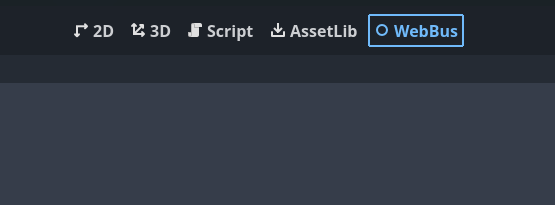

# WebBus
It's a plugin for the Godot engine. Use one plugin for several web platform SDKs.

This version is for Godot 4.x.
### Contents

- [Supported platforms](#supported-platforms)
- [Installation](#installation)
- [Usage](#usage)
  - [General](#general)
	  - [Advertisement](#advertisement)
    - [Game](#game)
    - [Other](#other)
  - [Yandex](#yandex)
	- [Ready](#ready)
	- [Leaderboards](#leaderboards)
  - [Crazy Games](#crazy-games)
	  - [Game](#game-1)
  - [Main Screen Menu](#main-screen-menu)
- [Features](#features)
  - [Archive](#archive)


## Supported platforms
- Crazy games
- Yandex games

## Installation

1. Download the plugin as a ZIP archive.
2. Extract the ZIP archive and move the `addons/` folder it contains into your project folder.
3. Enable the plugin in **Project > Project Settings > Plugins**.


## Usage

You can explore the demo scene for a better understanding of how to use the plugin.

### General

#### Advertisement

Calling full-screen advertisement:
```gdscript
WebBus.show_ad()
```
Calling rewarded advertisement:
```gdscript
WebBus.show_rewarded_ad()
```

For full-screen and rewarded advertisements, there are 4 callback signals:
```gdscript
signal reward_added
signal ad_closed
signal ad_error
signal ad_started
```

Calling banner advertisement:
```gdscript
WebBus.show_banner()
```

Close banner advertisement:
```gdscript
WebBus.hide_banner()
```
>For Crazy Games banner you can set the size and position in the [Main Screen Menu](#main-screen-menu)

#### Game

The `start_gameplay()` function has to be called whenever the player starts playing or resumes playing after a break.

```gdscript
WebBus.start_gameplay()
```

The `stop_gameplay()` function has to be called on every game break don't forget to call `start_gameplay(` when the gameplay resumes.

```gdscript
WebBus.stop_gameplay()
```

#### Other

Getting type of device:

The function return `String`, possible values: "desktop", "tablet", "mobile".

```gdscript
var device_type = WebBus.get_type_device()
```

Getting language:

The function return 2 letter is language code.

```gdscript
var language = WebBus.get_language()
```


### Yandex

#### Ready

Call `yandex_ready()` function when the game ready for game.

```gdscript
WebBus.yandex_ready()
```


#### Leaderboards

Features exclusive to Yandex games.

Get leaderboard description:
```gdscrript
WebBus.leaderboard_info_recieved.connect(getting_leaderboard_info)

WebBus.get_leaderboard_info(name_leaderboard)

func getting_leaderboard_info(info):
	print(info)

```

`name_leaderboard` : **String** type

`info` : **JavaScriptObject** type

Get leaderboard player entry:
```gdscrript
WebBus.leaderboard_player_entry_recieved.connect(getting_leaderboard_player_entry)

WebBus.get_leaderboard_player_entry(name_leaderboard)

func getting_leaderboard_player_entry(info):
	print(info.score)

```

`name_leaderboard` : **String** type

`info` : **JavaScriptObject** type

Get leaderboard entries:
```gdscrript
WebBus.leaderboard_entries_recieved.connect(getting_leaderboard_entries)

WebBus.get_leaderboard_entries(name_leaderboard, include_user=true, quantity_around=5, quantity_top=5)

func getting_leaderboard_entries(info):
	print(info.userRank)

```

`name_leaderboard` : **String** type

`include_user` : **bool** type, optional parameter

`quantity_around` : **int** type, optional parameter

`quantity_top` : **int** type, optional parameter

`info` : **JavaScriptObject** type

Save score in leaderboard:
```gdscript
WebBus.set_yandex_leaderboard(name_leaderboard, score, extra_data)
```

`name_leaderboard` : **String** type

`score` : **int** type

`extra_data` : optional parameter, **String** type

### Crazy Games
#### Game

The `crazy_happytime()` method can be called on various player achievements.

```gdscript
WebBus.crazy_happytime()
```

The `crazy_start_loading()` function has to be called whenever you start loading your game.

```gdscript
WebBus.crazy_start_loading()
```
The `crazy_stop_loading()` function has to be called when the loading is complete and eventually the gameplay starts.

```gdscript
WebBus.crazy_stop_loading()
```

### Main Screen Menu

In the main screen menu you can set your settings.



## Features

### Archive

For yandex export preset the zip archive will be generated automatically with the name `yandex_export.zip`. You can change the name to your own in [Main Screen Menu](#main-screen-menu).
