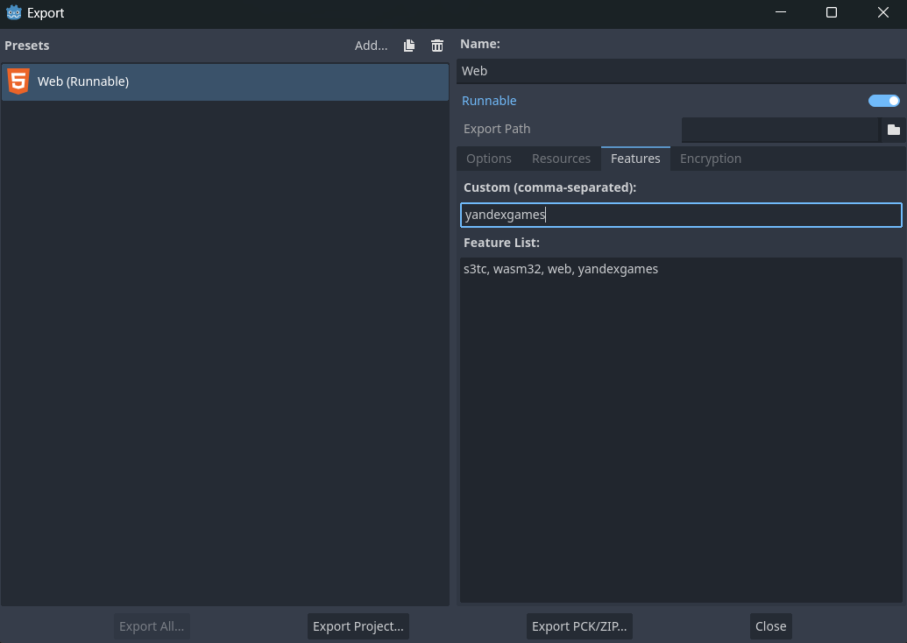

# WebBus
It's a plugin for the Godot engine. Use one plugin for several web platform SDKs.

This version is for Godot 4.
### Contents

- [Supported platforms](#supported-platforms)
- [Installation](#installation)
- [Usage](#usage)
  - [General](#general)
	- [Advertisement](#advertisement)
	- [Other](#other)
  - [Yandex](#yandex)
	- [Ready](#ready)
	- [Leaderboards](#leaderboards)
  - [Crazy Games](#crazy-games)
	- [Game](#game)
- [Features](#features)
  - [Archive](#archive)


## Supported platforms
- Crazy games
- Yandex games

## Installation

1. Download the plugin as a ZIP archive.
2. Extract the ZIP archive and move the `addons/` folder it contains into your project folder.
3. Enable the plugin in **Project > Project Settings > Plugins**.
4. Create web export presets.
5. Add the custom feature `yandexgames` or `crazygames` in the web export preset.
   >Add only one custom feature in one export preset.
6. Create an empty folder and set the **Export path** in this folder.
   > It is important that there are no extraneous files in the folder,
   > otherwise they will end up in the created zip archive.



## Usage

You can explore the demo scene for a better understanding of how to use the plugin.

### General

#### Advertisement

Calling full-screen advertisement:
```gdscript
WebBus.show_ad()
```
Calling rewarded advertisement:
```gdscript
WebBus.show_rewarded_ad()
```

For full-screen and rewarded advertisements, there are 4 callback signals:
```gdscript
signal reward_added
signal ad_closed
signal ad_error
signal ad_started
```

Calling banner advertisement:
```gdscript
WebBus.show_banner()
```

Close banner advertisement:
```gdscript
WebBus.hide_banner()
```

#### Other

Getting type of device:

The function return `String`, possible values: "desktop", "tablet", "mobile".

```gdscript
var device_type = WebBus.get_type_device()
```

Getting language:

The function return 2 letter is language code.

```gdscript
var language = WebBus.get_language()
```

### Yandex

#### Ready

Call `yandex_ready()` function when the game ready for game.

```gdscript
WebBus.yandex_ready()
```


#### Leaderboards

Features exclusive to Yandex games.

Get info about leaderboard:
```gdscrript
WebBus.leaderboard_info_recieved.connect(getting_leaderboard_info)

WebBus.get_leaderboard_info(name_leaderboard)

func getting_leaderboard_info(info):
	print(info)

```
`name_leaderboard` : **String** type


Save score in leaderboard:
```gdscript
WebBus.set_yandex_leaderboard(name_leaderboard, score, extra_data)
```

`name_leaderboard` : **String** type

`score` : **int** type

`extra_data` : optional parameter, **String** type

### Crazy Games
#### Game

The `crazy_happytime()` method can be called on various player achievements.

```gdscript
WebBus.crazy_happytime()
```
The `crazy_start_gameplay()` function has to be called whenever the player starts playing or resumes playing after a break.

```gdscript
WebBus.crazy_start_gameplay()
```

The `crazy_stop_gameplay()` function has to be called on every game break don't forget to call `gameplayStart()` when the gameplay resumes.

```gdscript
WebBus.crazy_stop_gameplay()
```
The `crazy_start_loading()` function has to be called whenever you start loading your game.

```gdscript
WebBus.crazy_start_loading()
```
The `crazy_stop_loading()` function has to be called when the loading is complete and eventually the gameplay starts.

```gdscript
WebBus.crazy_stop_loading()
```


## Features

### Archive

For yandex export preset the zip archive will be generated automatically with the name `yandex_export.zip`. You can change the name to your own in file `res://addons/WebSDKPlugin/export_plugin.gd`.

Example:
```gdscript
# You can change the archive name
const YANDEX_ARCHIVE_NAME = "you_archive_name.zip"
```
