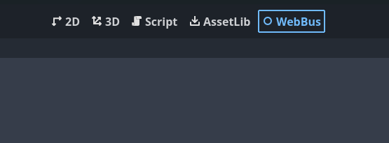

# WebBus


It's a plugin for the Godot engine. Use one plugin for several web platform SDKs.

This version is for Godot 4.x.
## Contents

- [Supported platforms](#supported-platforms)
- [Installation](#installation)
- [Usage](#usage)
   - [Advertisement](#advertisement)
   - [Game](#game)
   - [Ready](#ready)
   - [User Info](#user)
   - [Other](#other)
   - [Leaderboards](#leaderboards)
   - [Payments](#payments)
   - [Server time](#server-time)
   - [Game rating](#game-rating)
   - [Desktop shortcut](#desktop-shortcut)
   - [Pause](#pause)
- [Main Screen Menu](#main-screen-menu)


## Supported platforms
- Crazy games
- Yandex games
- Poki

| Feature            | Crazy Games | Yandex Games | Poki  |
|--------------------|:-----------:|:------------:|:------:|
| [Fullscreen Advertisement](#fullscreen-advertisement)     | ✅          | ✅           | ✅    |
| [Rewarded Advertisement](#rewarded-advertisement)       | ✅          | ✅           | ✅    |
| [Banner Advertisement](#banner-advertisement)       | ✅          | ✅           | ❌    |
| [User Info](#user)      | ✅          | ✅           | ❌    |
| [Leaderboards](#leaderboards)      | ❌          | ✅           | ❌    |
| [Payments](#payments)          | ❌          | ✅           | ❌    |
| [Invite Links](#invite-links)  | ✅          | ❌           | ✅    |
| [Invite Button](#invite-links)  | ✅          | ❌           | ❌    |
| [Server time](#server-time)       | ❌          | ✅           | ❌    |
| [Desktop shortcut](#desktop-shortcut)   | ❌          | ✅           | ❌    |

## Installation

1. Download the plugin as a ZIP archive.
2. Extract the ZIP archive and move the `addons/` folder it contains into your project folder.
3. Enable the plugin in **Project > Project Settings > Plugins**.


## Usage

You can explore the demo scene for a better understanding of how to use the plugin.


### Advertisement

#### Fullscreen Advertisement

Calling full-screen advertisement:

| Platform          | Supported |
|-------------------|-----------|
| Crazy Games       |  |
| Yandex Games      |  |
| Poki              |  |


```gdscript
WebBus.show_ad()
```

#### Rewarded Advertisement

Calling rewarded advertisement:

| Platform          | Supported |
|-------------------|-----------|
| Crazy Games       |  |
| Yandex Games      |  |
| Poki              |  |


```gdscript
WebBus.show_rewarded_ad()
```

For full-screen and rewarded advertisements, there are 4 callback signals:

| Platform          | Supported |
|-------------------|-----------|
| Crazy Games       |  |
| Yandex Games      |  |
| Poki              |  |


```gdscript
signal reward_added 
signal ad_closed
signal ad_error
signal ad_started
```


#### Full example

```gdscript
extends Node

func _ready():
	WebBus.ad_closed.connect(ad_closed)
	WebBus.ad_error.connect(ad_error)
	WebBus.ad_started.connect(ad_started)
	WebBus.reward_added.connect(reward_added)
  
  WebBus.show_ad()


func ad_started():
	AudioServer.set_bus_mute(0, true)


func ad_closed():
	AudioServer.set_bus_mute(0, false)
	

func ad_error():
	push_warning("ad_error")
	

func reward_added():
	$Player.add_gold(10)

```
#### Banner advertisement

Calling banner advertisement:

| Platform          | Supported |
|-------------------|-----------|
| Crazy Games       |  |
| Yandex Games      |  |
| Poki              |  |


```gdscript
WebBus.show_banner()
```

Close banner advertisement:

| Platform          | Supported |
|-------------------|-----------|
| Crazy Games       |  |
| Yandex Games      |  |
| Poki              |  |

```gdscript
WebBus.hide_banner()
```
>For Crazy Games banner you can set the size and position in the [Main Screen Menu](#main-screen-menu)

### Game

The `start_gameplay()` function has to be called whenever the player starts playing or resumes playing after a break.

| Platform          | Supported |
|-------------------|-----------|
| Crazy Games       |  |
| Yandex Games      |  |
| Poki              |  |

```gdscript
WebBus.start_gameplay()
```

The `stop_gameplay()` function has to be called on every game break, don't forget to call `start_gameplay()` when the gameplay resumes.

| Platform          | Supported |
|-------------------|-----------|
| Crazy Games       |  |
| Yandex Games      |  |
| Poki              |  |

```gdscript
WebBus.stop_gameplay()
```


The `happytime()` method can be called on various player achievements.

| Platform          | Supported |
|-------------------|-----------|
| Crazy Games       |  |
| Yandex Games      |  |
| Poki              |  |


```gdscript
WebBus.happytime()
```

The `start_loading()` function has to be called whenever you start loading your game.

| Platform          | Supported |
|-------------------|-----------|
| Crazy Games       |  |
| Yandex Games      |  |
| Poki              |  |

```gdscript
WebBus.start_loading()
```


### Ready

Call `ready()` when the game is fully loaded and ready to play. 

> **Note:** For Crazy Games, calling `ready()` is equivalent to `sdkGameLoadingStop()`. For Poki, this is equivalent to `gameLoadingFinished()`


| Platform          | Supported |
|-------------------|-----------|
| Crazy Games       |  |
| Yandex Games      |  |
| Poki              |  |

```gdscript
WebBus.ready()
```

### User

| Platform          | Supported |
|-------------------|-----------|
| Crazy Games       |  |
| Yandex Games      |  |
| Poki              |  |

`user_info` dictionary contains player's username and avatar link

```gdscript
print(WebBus.user_info)
# {"player_name": "NameOfPlayer", "avatar": "https://link/to/avatar.png"}

var name = WebBus.user_info.player_name
var avatar_link = WebBus.user_info.avatar
```

### Other

Getting name of platform:

The function returns a `String`. Possible values are: "yandex", "crazy_games", "poki"

| Platform          | Supported |
|-------------------|-----------|
| Crazy Games       |  |
| Yandex Games      |  |
| Poki              |  |

```gdscript
var platform_name = WebBus.get_platform()
```

Getting type of device:

The function returns a `String`, possible values: "desktop", "tablet", "mobile".

| Platform          | Supported |
|-------------------|-----------|
| Crazy Games       |  |
| Yandex Games      |  |
| Poki              |  |

```gdscript
var device_type = WebBus.get_type_device()
```

Getting language:

The function returns 2-letter language code.

| Platform          | Supported |
|-------------------|-----------|
| Crazy Games       |  |
| Yandex Games      |  |
| Poki              |  |

```gdscript
var language = WebBus.get_language()
```

### Invite

#### Invite Links

| Platform          | Supported |
|-------------------|-----------|
| Crazy Games       |  |
| Yandex Games      ||
| Poki              |    |

Create invite links with your parameters:

```gdscript
var result = await WebBus.invite_link(params)
```
`params` : **Dictionary** type

`result` : **Dictionary** type, invite link on this platform

Get parameters from link:

```gdscript
var value = await WebBus.get_invite_param(params)
```
`key` : **String** type

`result` : **Dictionary** type, invite link on this platform

#### Invite Button

| Platform          | Supported |
|-------------------|-----------|
| Crazy Games       |  |
| Yandex Games      ||
| Poki              |  |

Show invite button:

```gdscript
WebBus.show_invite_button(params)
```
`params` : **Dictionary** type

Hide invite button:

```gdscript
WebBus.hide_invite_button(params)
```

### Leaderboards

| Platform          | Supported |
|-------------------|-----------|
| Crazy Games       |  |
| Yandex Games      |  |
| Poki              |  |

Features exclusive to Yandex games.

Get leaderboard description:
```gdscript
WebBus.leaderboard_info_recieved.connect(getting_leaderboard_info)

WebBus.get_leaderboard_info(name_leaderboard)

func getting_leaderboard_info(info):
	print(info)

```

`name_leaderboard` : **String** type

`info` : **Dictionary** type

Get leaderboard player entry:
```gdscript
WebBus.leaderboard_player_entry_recieved.connect(getting_leaderboard_player_entry)

WebBus.get_leaderboard_player_entry(name_leaderboard)

func getting_leaderboard_player_entry(info):
	print(info.score)

```

`name_leaderboard` : **String** type

`info` : **Dictionary** type

Get leaderboard entries:
```gdscript
WebBus.leaderboard_entries_recieved.connect(getting_leaderboard_entries)

WebBus.get_leaderboard_entries(name_leaderboard, include_user=true, quantity_around=5, quantity_top=5)

func getting_leaderboard_entries(info):
	print(info.userRank)

```

`name_leaderboard` : **String** type

`include_user` : **bool** type, optional parameter

`quantity_around` : **int** type, optional parameter

`quantity_top` : **int** type, optional parameter

`info` : **Dictionary** type

Save score in leaderboard:
```gdscript
WebBus.set_leaderboard_score(name_leaderboard, score, extra_data)
```

`name_leaderboard` : **String** type

`score` : **int** type

`extra_data` : optional parameter, **String** type

### Payments

| Platform          | Supported |
|-------------------|-----------|
| Crazy Games       |  |
| Yandex Games      |  |
| Poki              |  |


Init yandex payments

```gdsript
WebBus.init_payments(signed)
```

`signed`: optional parameter, **bool** type

Make purchase

```gdscript
var purchase:Dictionary = await WebBus.purchase(product_id, developer_payload)
```

`product_id`: **String** type

`developer_payload`: optional parameter, **String** type

Get player's purchase list


```gdscript
var purchase_list:Array = await WebBus.get_purchases()
```

Get product list

```gdscript
var product_list:Array = await WebBus.get_catalog()
```

Consume purchase

```gdscript
var success:bool = await WebBus.consume_purchase(token)
```

`token`: **String** type

### Server time

| Platform          | Supported |
|-------------------|-----------|
| Crazy Games       |  |
| Yandex Games      |  |
| Poki              |  |


Get server time

```gdscript
var time:int = WebBus.get_server_time() # Example: 1720613073778
```

### Game Rating

| Platform          | Supported |
|-------------------|-----------|
| Crazy Games       |  |
| Yandex Games      |  |
| Poki              |  |


Check if the player can provide feedback:

```gdscript

var feedback_info = await WebBus.can_rewiew()
print(feedback_info.value) # bool

```

Request feedback from the player:

```gdscript

var feedback_request = await WebBus.request_review()
print(feedback_request.feedback_sent) # bool

```
### Desktop shortcut

| Platform          | Supported |
|-------------------|-----------|
| Crazy Games       |  |
| Yandex Games      |  |
| Poki              |  |

Check if the player can show a prompt:

```gdscript

var prompt = await WebBus.can_show_prompt()
print(prompt.can_show) # true or false

```

Show a prompt to the player:

```gdscript
var result = await WebBus.show_prompt()
print(result.outcome) # "accepted"
```

### Pause

| Platform          | Supported |
|-------------------|-----------|
| Crazy Games       |  |
| Yandex Games      |  |
| Poki              |  |

>[!NOTE]
>This function works on any hosting, including the test server Godot.


Sometimes the built-in Godot focus tracking tools may not work under specific conditions. To avoid unwanted behavior in such cases, this plugin provides signals:
- `focused`
- `unfocused`

Example:
```gdscript
WebBus.focused.connect(func():
	get_tree().set_pause(false))
WebBus.unfocused.connect(func():
	get_tree().set_pause(true))
```

## Main Screen Menu

In the main screen menu you can set your settings.

>You can enable automatic build archiving, but make sure the export folder does not contain any extraneous files.


